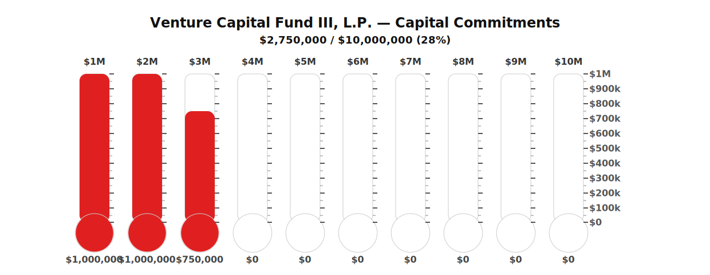

# Capital Commitments Thermometers (10 × $1M)

Campaign: **Quansight Initiate Fund III, L.P.**  
Goal: **$10,000,000 USD**

This generates 10 mini thermometers side-by-side, each representing **$1,000,000** of capital commitments (not cash collections).

## Update values
Edit `data/funds.json` (10 segment values in dollars) and commit.

- **Major ticks:** $100k
- **Minor ticks:** $50k
- **Bulb:** white at $0, turns red when segment > $0
- **Fill:** solid red grows from the bottom as the segment increases

## Workflow
The included GitHub Action rebuilds `thermometer.svg` on:
- Manual runs (**Actions → Run workflow**)
- Pushes that modify `data/funds.json`
- Pull requests that modify `data/funds.json`
